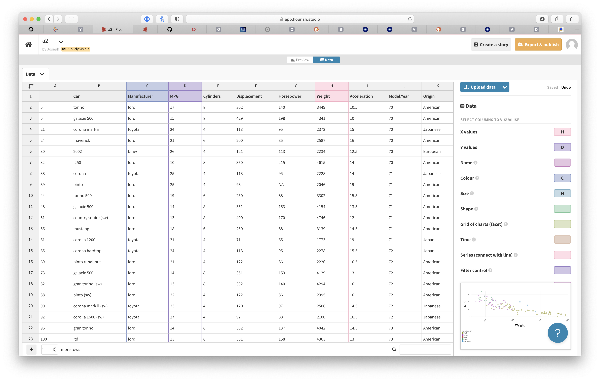

Assignment 2 - Data Visualization, 7 Ways  
===

Author
---
Joseph Yuen

Project Description
---
I used the following set of libraries, tools, and languages to recreate the same chart based on the cars-sample.csv.

1. d3
2. Flourish
3. Vega-lite
4. R+ggplot2
5. Tableau
6. GNUplot
7. Matplotlib

Some more words about the process and how I did it.

Libraries, Tools, Languages
===

d3
---
### Discussion
It was hard

### Image

Flourish
---
### Discussion
It was hard

### Image

Vega-lite
---
### Discussion
It was hard

### Image

R + ggplot 2
---
### Discussion
It was hard

### Image

Tableau
---
### Discussion
It was hard

### Image

GNUplot
---
### Discussion
It was hard

### Image

Matplotlib
---
### Discussion
It was hard

### Image

Achievements
===
## Technical
1. **Technical Achievement 1** - Description

## Design
1. **Design Achievement 1** - Description

Resources
===
