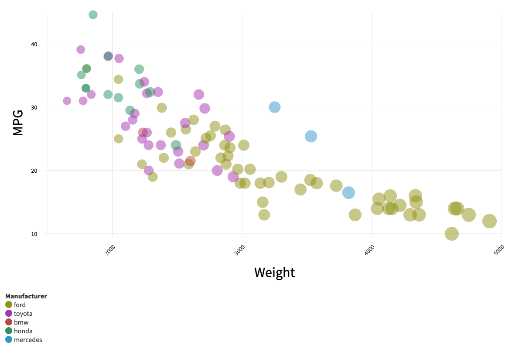
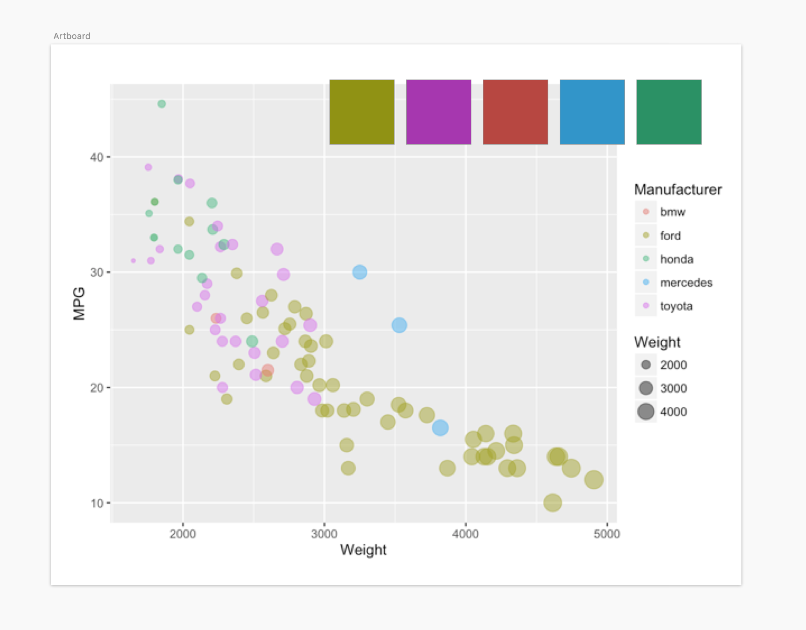

Assignment 2 - Data Visualization, 7 Ways  
===

Author
---
Joseph Yuen

Project Description
---
I used the following set of libraries, tools, and languages to recreate the same chart based on the cars-sample.csv.

1. d3
2. Flourish
3. Vega-lite
4. R+ggplot2
5. Tableau
6. Excel
7. Matplotlib

Libraries, Tools, Languages
===

d3
---
### Discussion
d3 is a JS library that gives the user low level tools to create visualizations based on data. 

In my implementation, I created the axis and then added data points in the fetch to the csv file. When collecting the points, I added functions that changed the color of circles based on their manufacturer. 

I thought that d3 was the most difficult of the tools as it gave the most customization. However, the higher difficulty can be worth it as d3 can produce complex visualizations that have truly unique interactions. For example, it was  annoying to move the circles separately from the axis. In addition, it was strange to add a title to each of the axis. Most of the programs I used had an automatic feature to create an axis title. But even so, I see why d3 does this as to give more freedom to the developer.

Link to Project:
https://jhyuen.github.io/02-datavis-7ways/tools/d3/

### Screenshots

Flourish
---
### Discussion
Flourish describes itself as a "CMS for interactive content." It is a data vis online software that makes it easy for people to make complex visualizations with no coding necessary. I think of it as a simpler version of Tableau for those who have little data experience.

The program has the user first load in their data and then has them fill out the x, y, size, and color information. I found this setup to be relatively simple as it produced a graph very close to the end product in a matter of minutes. I then spent most of my time editing the axis to make sure I had the right intervals.

As I've said before, I found the program to be really simple to adopt and can see myself using it in the future for quick and casual visualizations. I also will likely suggest it to peers who do not code and are new to making visualizations.

Link to Project:
https://public.flourish.studio/visualisation/5379670/

### Screenshots

Vega-lite
---
### Discussion
Vega-lite is a "high-level grammar" for data visualizations. It provides a relatively easy to follow syntax that automatically produces many necessary objects such as axis and legends.

To make this scatter plot, I examined JSON implementations of scatter plot examples and then converted it into a JS implementation with the correct values. When writing the JS, I only had to define the x axis, y axis, circle color, and circle size with a couple lines of codes. Everything else was taken care of automatically.

Vega-lite in its JSON implementation is straight forward and relatively easy to use. My biggest difficulty was converting the JSON into JS. I can see it being a tool for data scientists with a minimal understanding of programming to communicate data quickly. However, there's not too many customization options for aesthetics which may prevent it from being used for general audiences that likely want more aesthetically pleasing visualizations.

Link to Project:
https://jhyuen.github.io/02-datavis-7ways/tools/vega-lite/

### Screenshots

R + ggplot 2
---
### Discussion
ggplot2 is a statistics and data vis library for the coding language R. It is commonly used with RStudio to provide users with an easy to use interface that shows existing variables and graph output. 

I looked at some implementations of ggplot2 to get started and was able to write the entire graph in about 3 lines of code. Since the default picture was made in ggplot2, they are almost identical. 

I found that ggplot2 was relatively easy to code, but I found setup to be  annoying. When I downloaded the ggplot2 package, it kept requiring me to download dependencies that wouldn't download. Eventually, I moved to using RStudio within Anaconda for package management. When I used RStudio to add packages, I had the same issue. I realized I had to download the packages through Anaconda. And even though I could download new packages in Anaconda, I still had to download the many dependencies for ggplot2 to run. For that reason, I wouldn't recommend this to a new data vis user. I see this library similarly to Vega-lite which requires a little more coding knowledge and can be used for quick and informative graphs.

See tools/r-ggplot2 for .Rproj

### Screenshots

Tableau
---
### Discussion
Tableau is a popular no coding required (although you can code for custom features) data vis tool. It offers many hover and filter features that can be used to make interactive dashboards.

To make the scatter plot, I loaded the data into Tableau and then assigned the rows (y-axis) and columns (x-axis) with the appropriate data. Then I defined the circles' color and size by selecting a couple drop down menus, and in minutes I had a fully functional data vis with hover features over each data point.

I thought that Tableau was simple to use as I did not have to use any sort of tutorial. However, I think that it can be intimidating for users less familiar data. It is more complex than Flourish, but it also offers many more features. The benefit of Tableau is that it can be used to make both quick and complex aesthetically pleasing visualizations with no coding required.

See tools/tableau for .twb

### Screenshots

Excel
---
### Discussion
Excel is an extremely popular spreadsheet program that offers a wide variety of features to analyze and visualize said spreadsheets.

To make the graph, I isolated the columns that were significant: MPG, Weight, and Manufacturer. I selected the columns and then pressed the button that automatically made a bubble graph. Even though I hoped that a perfect graph would appear, data was assigned to the wrong axis and were all colored the same size. I then went edited the graph but I ran into the issue of assigning colors to each manufacturer. I thought that this would be a built in feature given Excel's popularity, but it was sadly not available. I had to make separate columns that isolated the values for each manufacturer and assign them as "Series." Doing so allowed me to color each series and achieve the desired effect.

Given that Excel is widely used across various industries, I thought that Excel would be relatively easy to use. However, it was much more tedious to use than other programs. I think that most of my issues derived from Excel's weaker UI design in comparison to data vis programs like Flourish. I think that Excel is useful for people who are already use Excel in their line of work. It's also useful for quick graphs but not necessarily complex, custom visualizations. Even though I complained about Excel's complicated UI, I only spent 20 minutes longer to make the graph.

I used 2 hacks in Excel. First, I used shapes to cover the minimum value labels. By default, Excel makes the minimum value (ex: 10 and 2000) at the left bottom corner of the graph which cuts off values less than 2000. Thus, I made the actual minimum value to be 0 and 1000 and then moved the x and y axis inward. To eliminate the 0 and 1000 labels, I covered them with a white rectangle. Second, I set the y axis' maximum range to 49 which prevented Excel from adding 50 at the top but still keep the top green dot. 

See tools/excel for .xlsx

### Screenshots

Matplotlib
---
### Discussion
Matplotlib is a Python library used to make static, animated, and interactive visualizations.

To implement the scatter plot, I used a Jupyter notebook to write Python. I loaded the data and stored it in a Pandas dataframe. Then, I set the size of the graph and set the various axis to the correct value. Then I specified the size and color. To set the color of each point, I used an array that contained associations between manufacturer and color such as "ford":"green".

Although the syntax wasn't as intuitive as Vega-lite, I thought that the process of making a graph was rather simple and powerful. Even though it's not as complex as d3, it still offers a wide variety of customization options that can be used to make interactive custom visualizations. Matplotlib is helpful to make quick visualizations with minimal effort. Although it's not as simple as other programs like Flourish and may not be as visually beautiful as d3 or Tableau, Matplotlib offers a middle ground that is likely useful to data scientists who regularly use Python as Matplotlib reads in Python Pandas dataframes.

See tools/matplotlib for .ipynb

### Screenshots

Achievements
===
## Technical
1. **NA Handling** - As libraries such as ggplot2 automatically eliminated Weight MPG pairs with NA values, I eliminated rows that had NA values in MPG. By doing so, all of my graphs looked the same as some libraries caused NA values to either default to 0 or mark at the top of my graph. 
2. **Extra Library** - Even though the base requirement was to use 3 libraries, I used an additional library to total 4 libraries: Matplotlib (Python), ggplot2 (R), d3 (JS), and Vega-lite (JS).
3. **Maintained Aspect Ratio for d3** - I wrapped my d3 implementation in a viewBox with a 1920x1080 aspect ratio. As a result, my points and text automatically scale down as the window becomes smaller.
4. **d3 Hover** - Data Visualization tools like Tableau allowed the user to hover over a point and get more information on it. I implemented a similar functionality in d3. Upon hovering on a point, I add a tooltip and raise the opacity to 1 for the selected point.

## Design
1. **Flourish Similar Colors** - When making the Flourish graph, I wanted to get the exact colors from the example. To do so, I pulled the example picture into Sketch and used the eye drop tool to get the hex values. I soon realized that the values needed to be darker in order to compensate for the opacity 0.5. As a result, I decreased the luminance of each value. Below you can see my Flourish implementation and my Sketch Artboard that contains the example plot.

1. **d3 Font Change** - Every tool, except d3, used a sans-serif font. By default, d3 had sans-serif font for its axis major tick labels, but had a serif font specifically for the axis text label. In order to maintain consistency across all of the tools, I changed the font of the text to a sans-serif font using CSS and d3. Below were the original states of the plots.

Resources
===
Vega-Lite: https://vega.github.io/vega-lite/tutorials/getting_started.html#tutorial-overview

R-ggplot2: http://r-statistics.co/Complete-Ggplot2-Tutorial-Part1-With-R-Code.html